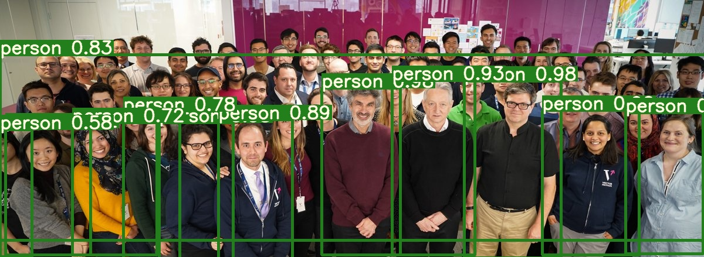
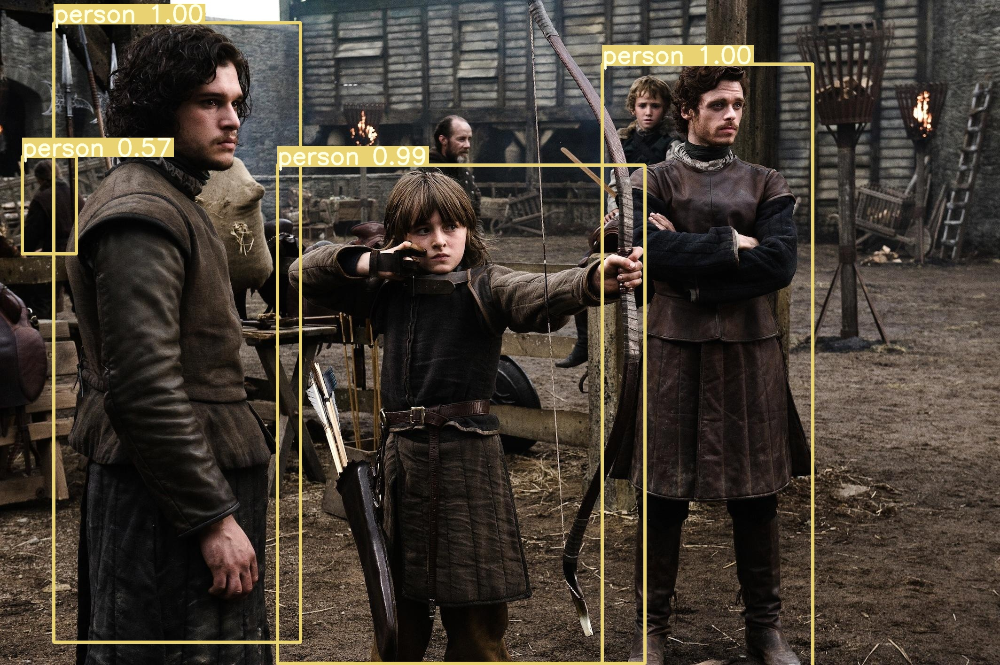
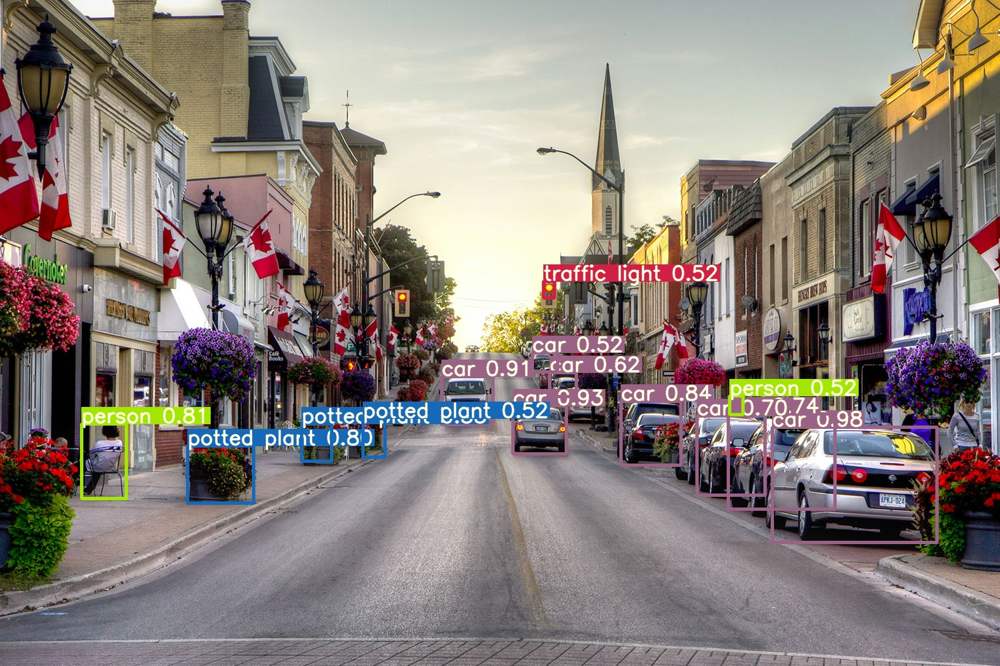
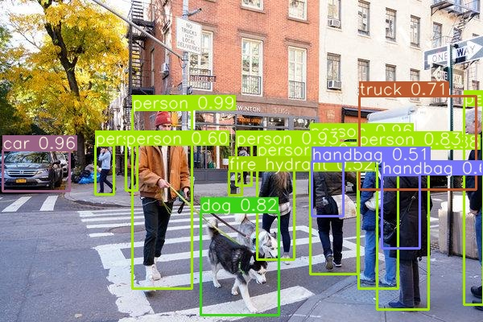
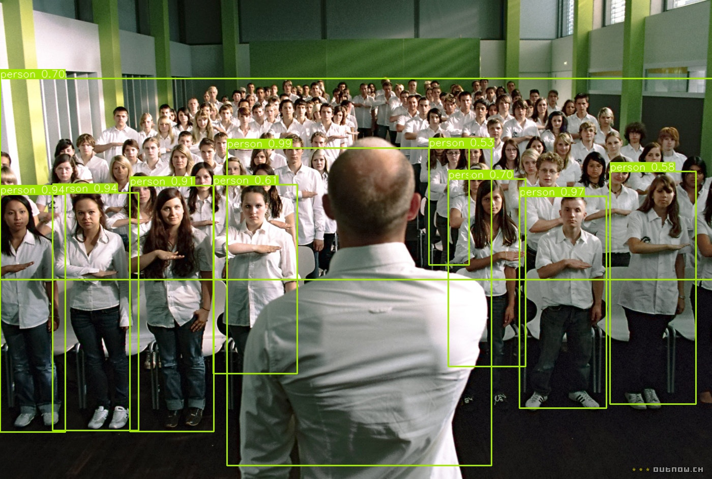
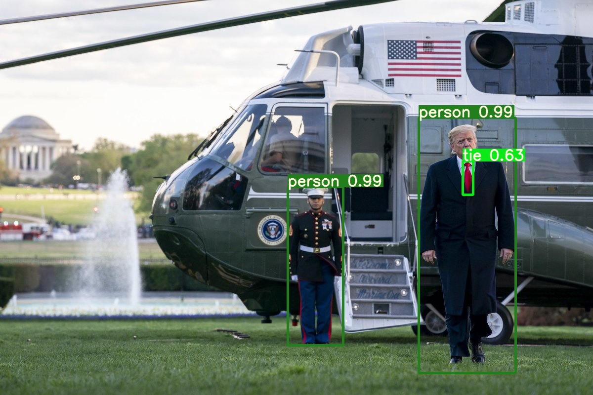

### YOLOv3



### Description

This repository is as a product when I started learning object detection. It contains implementation of training and inference code of YOLOv3 in PyTorch. It is self-contained on mainstream platform and it supports custom data trianing and multi GPUs as well. Credit to Joseph Redmon for [YOLO](https://pjreddie.com/darknet/yolo/) and the paper can be found [here](https://pjreddie.com/media/files/papers/YOLOv3.pdf). I am highly inspired by these two repositories: 
* [ultralytics/yolov3](https://github.com/ultralytics/yolov3) 
* [ydixon/yolo_v3](https://github.com/ydixon/yolo_v3).   
Followed their codes, helped me walkthrough the yolov3 algorithm. Then I reconstructed & rewrited them to try to reimplement it. It is recommended to read their codes to see the specific implementation steps and logic. Also you can just go to the [Dev]() for more details of YOLOv3.


### Requirements

  - python >= 3.6
  - numpy
  - torch >= 1.0.0
  - opencv
  - json
  - matplotlib
  - CUDA(optional)


### Download Data
```sh
$ cd data/
$ bash get_coco_dataset.sh
```

### Pretrained Weights
The pretrained weights can be found on [Google Drive](https://drive.google.com/drive/folders/1uxgUBemJVw9wZsdpboYbzUN4bcRhsuAI), download yolov3-tiny.conv.15 & darknet53.conv.74 and place under the weights folder. Actually, they can be downloaded automatically. However, if you want to train the model from scratch, you can skip this step.

### Training
*  **COCO dataset** Just open [train.ipynb](train.ipynb) and run all cells respectively. It will train yolov3 using COCO dataset. Using FROM_SCRATCH to control whether train from scratch.
* **Custom dataset** For custom data training, you should get your own data ready and make annotations format is the same as yolo's. Bascially, you should modidy coco.data & coco.names to satisfy your dataset and also you should modify \*.cfg file, make yolo layers outputs satisfy the number of class of your dataset. There is a nice instruction about how to train custom dataset, which can be found [here](https://github.com/ultralytics/yolov3/wiki/Train-Custom-Data). After you get everything ready, run all cells of train.ipynb.


### Inference

Open [detect.ipynb](detect.ipynb) and run it. It can detect objects for a single image or more under sample folder. The result images with predicted bounding box are saved under output folder.

 
 
  


License
----
[](https://github.com/996icu/996.ICU/blob/master/LICENSE)


   
## Notice

Please note, this is a research project! It should not be used as a definitive guide on object detection. Many engineering features have not been implemented. The demo should be considered for research and entertainment value only.
